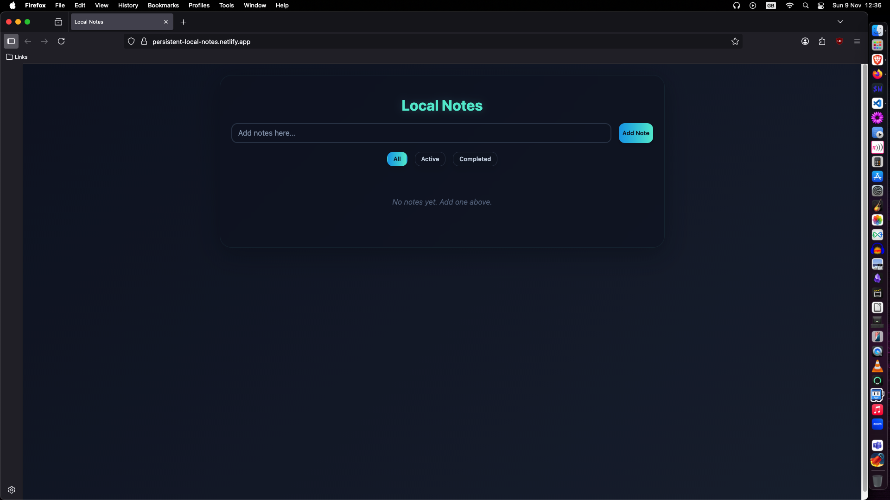

<br>

# 📝 Local Notes

<br>

A minimal, fast, and privacy-first note-taking app that runs entirely in your browser.

<br>



<br>

## ✨ Features

<br>

- **Add / Delete** notes instantly  
- **Mark as completed** with a single click  
- **Filter** by All, Active, or Completed  
- **Persistent** – everything is auto-saved to `localStorage`  
- **Responsive** – works great on desktop and mobile  
- **One dependency** - via the AlpineJS CDN

<br>

## 🚀 Quick Start

<br>

1. Clone or download this repo
   ```bash
   git clone https://github.com/sammi-turner/Local-Notes
   ```

2. Open `index.html` in any modern browser – that’s it!

<br>

No build step, no server, no API keys.

<br>

## 🧱 Tech Stack

<br>

| Piece        | What it does                     |
|--------------|----------------------------------|
| AlpineJS 3.x | Reactive UI & state management   |
| native JS    | Business logic (`main.js`)       |
| CSS          | Clean, dark-theme styling        |
| localStorage | Zero-config persistence          |

<br>

## 📁 Project Structure

<br>

```
local-notes/
├── index.html      – markup & Alpine directives
├── main.js         – Alpine data & methods
└── styles.css      – all styling (dark theme)
```

<br>

## 🔧 Customization

<br>

| File        | Tweak to...                                      |
|-------------|--------------------------------------------------|
| `styles.css`| Change colors, fonts, spacing, light theme, etc. |
| `main.js`   | Add tags, due-dates, search, export, etc.        |
| `index.html`| Re-arrange layout or add extra buttons           |

<br>
